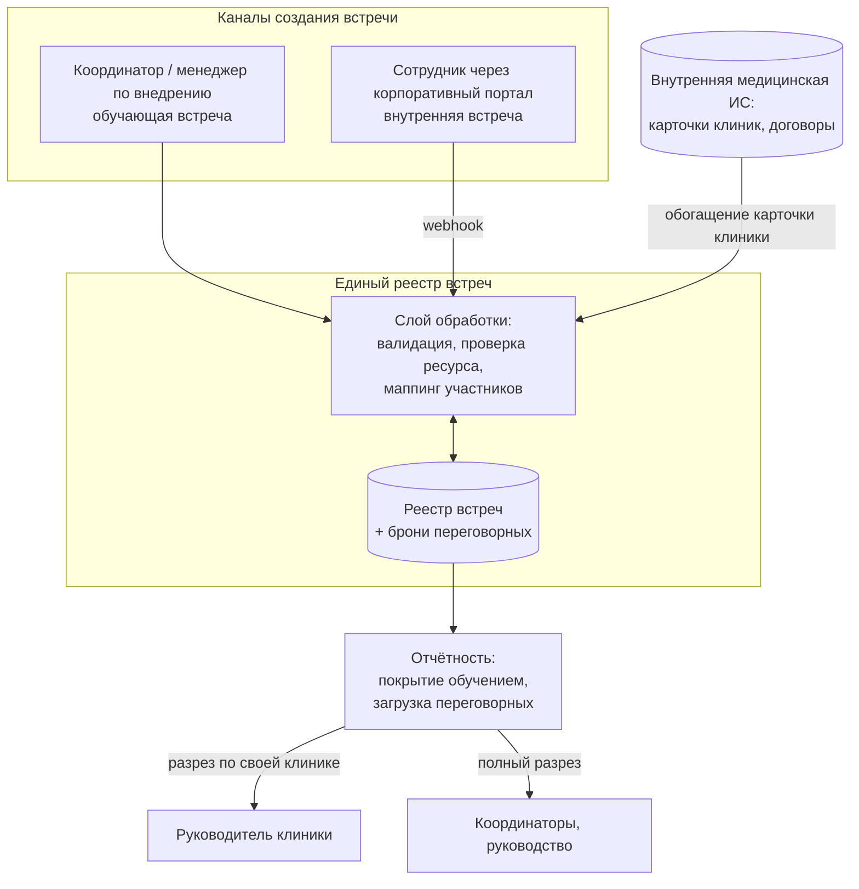
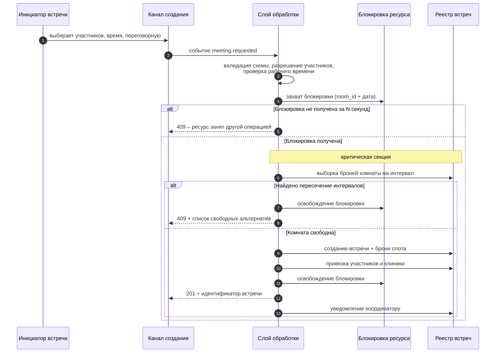
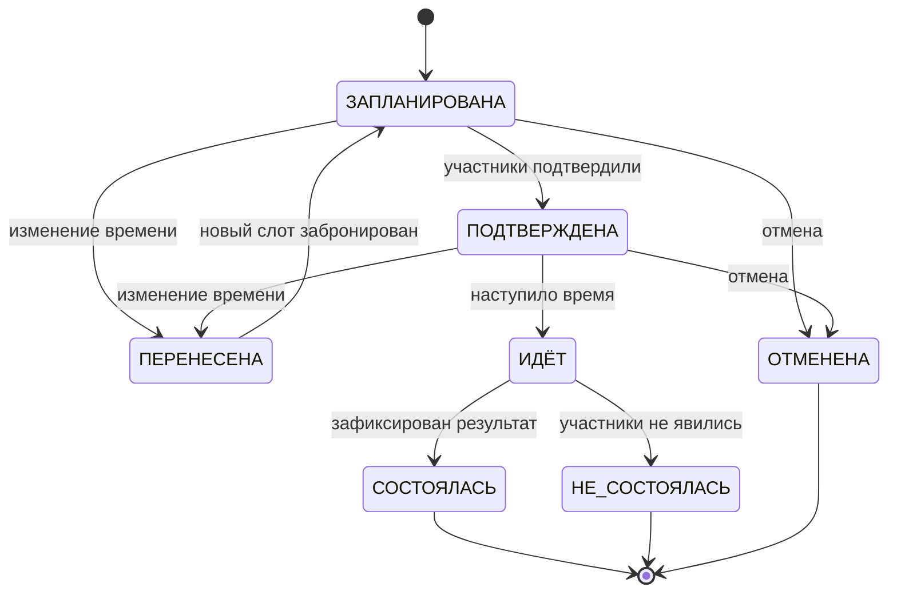
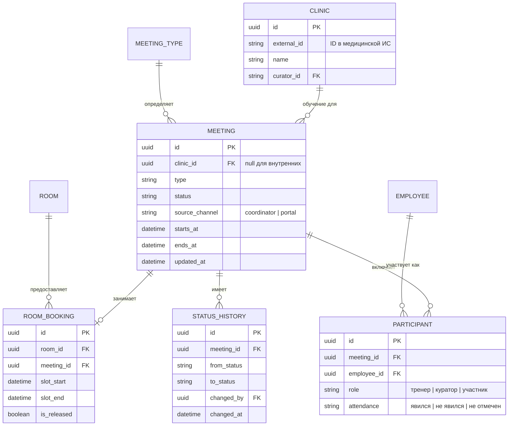
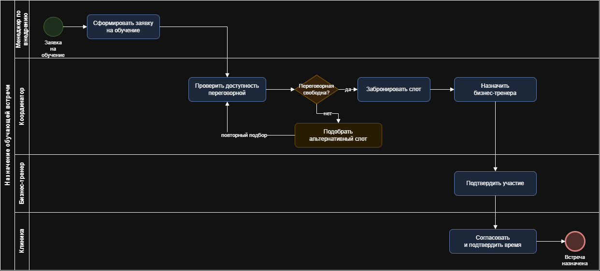

# Кейс 01 · Управление встречами и переговорными

Проектирование единой системы управления встречами: обучающие встречи
с клиниками-клиентами и внутренние встречи сотрудников конкурируют
за общий ограниченный ресурс – переговорные комнаты.

## 1. Контекст

Компания сопровождает сеть клиник-клиентов: обучает персонал работе
с продуктом, ведёт кураторство и отчётность. Параллельно внутри компании
идут собственные встречи сотрудников. Оба потока конкурируют за один
ограниченный ресурс – переговорные комнаты.

## 2. Роли

| Роль | Сторона | Создать обучающую встречу | Создать внутреннюю | Назначить тренера | Менять статус | Отчётность |
|---|---|---|---|---|---|---|
| Координатор | компания | ✓ | ✓ | ✓ | ✓ | полная |
| Менеджер по внедрению | компания | ✓ | ✓ | ✓ | по своим | по своим клиникам |
| Бизнес-тренер | компания | – | ✓ | – | результат обучения | по своим встречам |
| Менеджер клиник | компания | – | ✓ | – | – | по курируемым |
| Руководитель / владелец клиники | клиент | – | – | – | – | по своей клинике |
| Ассистент, врач | клиент | – | – | – | – | – |
| Сотрудник компании | компания | – | ✓ (самообслуживание) | – | отмена своей | – |

Ключевое проектное решение: **руководитель клиники – внешний пользователь**
с доступом к отчётности только по своему юрлицу. Это отдельная ветка
разграничения доступа, а не просто «роль с правами на чтение».

## 3. Процесс as-is и его проблемы

- Обучающие встречи назначает менеджер по внедрению, внутренние –
  сотрудники договариваются между собой в корпоративном портале.
  Два независимых источника, не знающих друг о друге.
- Переговорные бронируются вручную, в отдельной таблице. Двойные брони
  обнаруживаются в момент встречи.
- У встречи нет статусной модели: непонятно, состоялась ли, кто пришёл,
  чем закончилась.
- Встреча не связана с карточкой клиники – нельзя посчитать, какие клиники
  обучены, а какие нет.

## 4. Целевое решение

## 5. Бронирование при конкурентном доступе

**Условие пересечения интервалов.** Две брони конфликтуют, если
`начало_A < конец_B` **и** `конец_A > начало_B`. Проверки «одинаковое время»
недостаточно: встреча 10:00–11:00 не совпадает со встречей 10:30–11:30,
но перекрывается с ней.

**Почему блокировка на уровне приложения, а не транзакция БД.** Платформа
не даёт транзакционных гарантий между чтением и записью: между «проверил,
что свободно» и «записал бронь» есть окно, в которое успевает второй запрос.
Блокировка на уровне ресурса закрывает это окно.

**Почему ключ блокировки `room_id + дата`, а не глобальная блокировка.**
Глобальная блокировка сериализует вообще все бронирования компании
и превращается в бутылочное горлышко. Ключ по ресурсу и дню даёт
параллелизм там, где конфликта быть не может.

## 6. Статусная модель

**Правило освобождения ресурса.** Переходы в `ОТМЕНЕНА`, `ПЕРЕНЕСЕНА`
и `НЕ_СОСТОЯЛАСЬ` освобождают бронь переговорной (`is_released = true`).
Забытое освобождение – самая частая дыра в подобных системах: комната
числится занятой встречей, которой не будет.

## 7. Модель данных

Поле `source_channel` (координатор / портал) – маркер канала создания.
Заложен на этапе проектирования, чтобы без доработок считать, какая доля
встреч идёт через самообслуживание, а какая через координаторов.

## 8. Отчётность

| Метрика | Разрез | Потребитель |
|---|---|---|
| Покрытие клиник обучением | клиника, период | руководство, менеджер по внедрению |
| Доля несостоявшихся встреч | тренер, клиника, период | координаторы |
| Загрузка переговорных | комната, день недели, час | АХО, координаторы |
| Встречи по своей клинике | клиника | руководитель клиники (внешний доступ) |

## 9. Ограничения решения

- Блокировка реализована на уровне приложения, а не БД – следствие
  ограничений платформы. При росте нагрузки корректнее уносить
  резервирование в отдельный сервис с транзакционной БД.
- Обработка события синхронная, без очереди. При недоступности реестра
  инициатор получает ошибку вместо отложенной обработки.
- Часовые пояса: решение исходит из одного часового пояса. Для
  распределённых команд требуется хранение времени в UTC и приведение
  на клиенте.
- Отчётность строится запросами к оперативным данным. При росте объёма
  нужен отдельный слой агрегатов.

## 10. BPMN: назначение обучающей встречи

Схема в нотации BPMN 2.0 (draw.io): дорожки «Менеджер по внедрению →
Координатор → Бизнес-тренер → Клиника», шлюз проверки доступности
переговорной, ветка эскалации при занятости.

