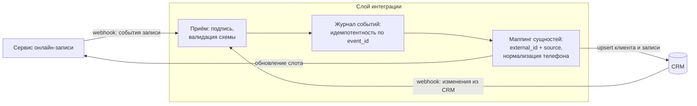
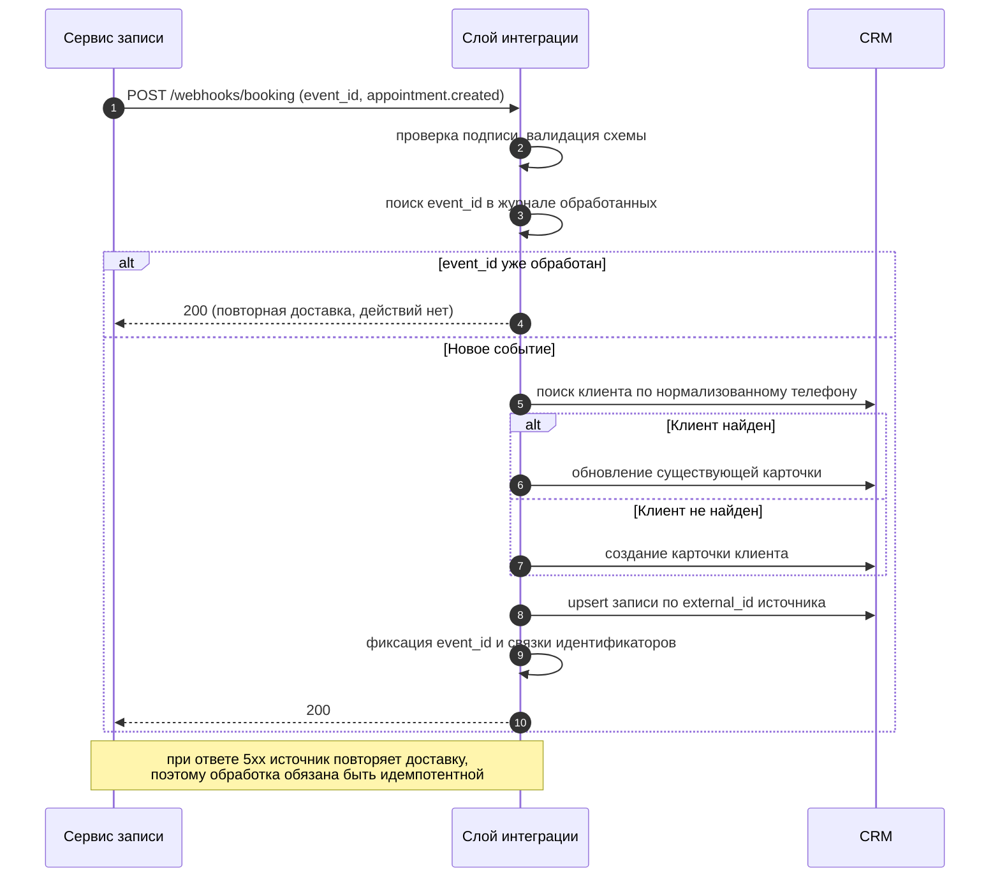

# Кейс 02 · Синхронизация онлайн-записи с CRM

Событийная двусторонняя интеграция сервиса онлайн-записи пациентов с CRM:
идемпотентная обработка вебхуков, сопоставление сущностей по внешним
идентификаторам, разрешение конфликтов при рассинхронизации.

## 1. Контекст

Клиники принимают запись пациентов через сервис онлайн-записи (виджет
на сайте и агрегатор). Операционная работа – воронка лидов, обзвон,
контроль загрузки – ведётся в CRM. Записи должны попадать в CRM
в реальном времени, а изменения из CRM (перенос, отмена) – возвращаться
в сервис записи.

## 2. Процесс as-is и его проблемы

- Администраторы переносили записи в CRM вручную: часть терялась,
  часть появлялась с опозданием в несколько часов.
- Один пациент заводился повторно при каждой новой записи – карточки
  дублировались, история терялась.
- Отмена в одном из контуров не отражалась в другом: обзванивали
  отменённые записи, а освободившиеся слоты простаивали.

## 3. Требования

**Функциональные**

| # | Требование |
|---|---|
| FR-1 | Новая запись появляется в CRM не позднее 1 минуты после создания |
| FR-2 | Перенос и отмена записи синхронизируются в обе стороны |
| FR-3 | Пациент сопоставляется с существующей карточкой по нормализованному телефону; дубли не создаются |
| FR-4 | Каждая запись связана с внешним идентификатором системы-источника |

**Нефункциональные**

| # | Требование |
|---|---|
| NFR-1 | Повторная доставка одного события не порождает дублей (идемпотентность) |
| NFR-2 | При временной недоступности CRM события не теряются (ретраи на стороне источника + журнал) |
| NFR-3 | Все входящие события журналируются для разбора инцидентов |
| NFR-4 | Вебхуки принимаются только с валидной подписью (HMAC) |

## 4. Архитектура

## 5. Обработка события: новая запись

## 6. Идемпотентность и дедупликация

- **Ключ идемпотентности события** – `event_id` вебхука. Обработанные
  идентификаторы хранятся в журнале; повторная доставка отвечает 200
  без побочных эффектов.
- **Ключ сопоставления сущностей** – пара `external_id + source`.
  Все операции записи – upsert, а не create: повторный прогон безопасен.
- **Сопоставление клиентов** – телефон, нормализованный к формату E.164.
  Разные написания одного номера (8..., +7..., со скобками) сводятся
  к одному ключу до поиска.

## 7. Разрешение конфликтов

Запись может быть изменена в обоих контурах между синхронизациями.
Правило «кто последний, тот и прав» целиком – опасно: затирает данные,
которых во втором контуре нет. Поэтому владение определено на уровне полей:

| Поле | Владелец | Правило |
|---|---|---|
| Время приёма, врач, филиал | сервис записи | значение источника записи приоритетно |
| Статус обзвона, комментарии менеджера | CRM | не перезаписываются событиями записи |
| Отмена записи | оба контура | принимается из любого источника; при одновременном изменении побеждает более поздний `updated_at` |

## 8. Обработка ошибок

| Ситуация | Поведение |
|---|---|
| CRM недоступна | ответ 5xx источнику → источник повторяет доставку с нарастающей задержкой; событие в журнале |
| Невалидная подпись | 401, событие не обрабатывается, инцидент в лог |
| Невалидная схема события | 400 + причина; событие в журнал ошибок для разбора |
| Дубль вебхука | 200 по журналу `event_id`, без побочных эффектов |
| Телефон не парсится | запись создаётся, клиент помечается на ручную сверку |

## 9. Контракт интеграции

Входящий API слоя интеграции описан в [openapi.yaml](./openapi.yaml):
эндпоинты вебхуков от сервиса записи и от CRM, схемы событий,
коды ответов и семантика повторных доставок.

## 10. Результат

- Ручной перенос записей исключён; запись появляется в CRM за секунды.
- Дубли карточек по телефону прекратились – история пациента в одном месте.
- Отмены синхронизируются: обзвон отменённых записей и простой слотов ушли.

## 11. Ограничения решения

- Очереди сообщений нет: гарантия доставки держится на ретраях источника.
  При длительной недоступности CRM события досылаются из журнала
  по расписанию – это ручная деградация, а не автоматическая.
- Порядок доставки событий не гарантирован, поэтому решения принимаются
  по `updated_at` данных, а не по порядку прихода вебхуков.
- Сопоставление по телефону несовершенно: семейные записи с одного номера
  попадают в одну карточку – для таких случаев предусмотрена ручная сверка.
