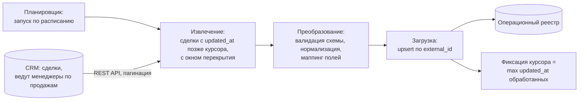

# Кейс 03 · Периодическая выгрузка сделок в операционный реестр

Инкрементальный ETL-пайплайн: сделки из CRM по расписанию попадают
в операционный реестр, где с ними работает бэк-офис. Ключевые решения –
загрузка по курсору, идемпотентный upsert, устойчивость к сбоям
посреди прогона.

## 1. Контекст

Менеджеры по продажам ведут клиентов и сделки в CRM. Дальнейшая
операционная работа – дозаполнение данных, контроль статусов подготовки
документов – идёт в отдельном операционном реестре. Новые и изменённые
сделки должны регулярно попадать из CRM в реестр без ручного переноса.

## 2. Процесс as-is и его проблемы

- Выгрузка делалась вручную: экспорт из CRM и копирование в реестр.
  Забывали, теряли строки, приносили дубли.
- Полная выгрузка всей базы на каждый перенос – долго и упирается
  в лимиты API CRM.
- При изменении сделки в CRM реестр узнавал об этом только со следующим
  ручным переносом, если узнавал вообще.

## 3. Требования

| # | Требование |
|---|---|
| FR-1 | В реестр попадают только новые и изменённые с прошлого прогона сделки |
| FR-2 | Повторный прогон не создаёт дублей строк |
| FR-3 | Изменения сделки в CRM обновляют существующую строку реестра, а не добавляют новую |
| NFR-1 | Прогон укладывается в лимиты API CRM (пагинация, троттлинг) |
| NFR-2 | Сбой посреди прогона не приводит к потере данных: следующий прогон дозабирает всё |
| NFR-3 | Изменение схемы полей на стороне CRM обнаруживается валидацией, а не молчаливой порчей данных |

## 4. Целевое решение

## 5. Инкрементальная загрузка по курсору

Пайплайн хранит курсор – `updated_at` последней обработанной сделки.
Каждый прогон запрашивает у CRM сделки с `updated_at` позже курсора
**минус окно перекрытия** и после успешной записи в реестр сдвигает курсор
на максимальный `updated_at` из обработанных.

Зачем окно перекрытия:

- часы источника и пайплайна не синхронны идеально;
- несколько сделок могут иметь одинаковый `updated_at` на границе курсора;
- сделка могла быть изменена в момент прошлого прогона и не попасть в выборку.

Перекрытие означает, что часть сделок обрабатывается повторно, – это
безопасно, потому что загрузка идемпотентна (см. ниже). Классический
размен: небольшая избыточная работа в обмен на гарантию «ничего не потеряли».

## 6. Дедупликация и идемпотентность

- Ключ строки реестра – `external_id` сделки из CRM.
- Все операции записи – upsert: существующая строка обновляется,
  новая добавляется.
- Следствие: любой прогон можно повторить целиком без последствий –
  это же свойство закрывает восстановление после сбоев.

## 7. Обработка сбоев

| Ситуация | Поведение |
|---|---|
| Сбой посреди прогона | курсор не сдвинут → следующий прогон повторяет выборку; upsert делает повтор безопасным |
| Лимиты API CRM | пагинация + троттлинг запросов; при 429 – пауза с нарастающей задержкой |
| Изменилась схема полей CRM | валидация схемы на шаге преобразования: прогон останавливается с алертом, данные в реестр не пишутся |
| Невалидные значения в отдельной сделке | сделка откладывается в отчёт об ошибках (строка, поле, причина), остальные загружаются |

## 8. Результат

- Ручной перенос сделок исключён; реестр отстаёт от CRM не более чем
  на интервал расписания.
- Дубли строк прекратились: ключ `external_id` + upsert.
- Инциденты «потеряли сделку» закрыты конструктивно – курсором
  с перекрытием, а не внимательностью исполнителя.

## 9. Ограничения решения

- Курсор по `updated_at` не ловит **удаления** в источнике: удалённая
  в CRM сделка остаётся в реестре. Компенсация – периодическая полная
  сверка по расписанию, помечающая осиротевшие строки.
- Реестр не транзакционен: между записью строк и сдвигом курсора есть
  окно, в котором сбой приводит к повторной обработке (безопасно),
  но не к откату (недостижимо на этой платформе).
- Пайплайн однопоточный. При росте объёмов первым шагом ускорения будет
  параллельная выборка по сегментам, но это потребует пересмотра
  модели курсора.
