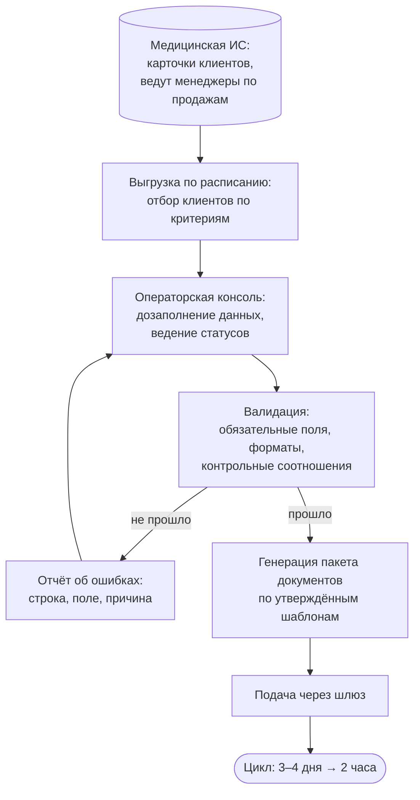

# Кейс 04 · Автоматизация подготовки отчётности

Многоступенчатый пайплайн подготовки пакета документов для подачи
во внешний контролирующий орган: выгрузка из внутренней системы,
операторское дозаполнение (human-in-the-loop), валидация, генерация
документов по шаблонам, подача через шлюз. Цикл сократился
с 3–4 дней до 2 часов.

## 1. Контекст

Компания регулярно готовит для клиентов пакет документов, который подаётся
во внешний орган через электронный шлюз. Исходные данные о клиентах живут
во внутренней медицинской ИС и ведутся менеджерами по продажам. Часть
данных, необходимых для документов, в системе отсутствует в принципе –
она появляется позже, в общении с клиентом.

## 2. Процесс as-is и его проблемы

- Данные собирались вручную из карточек, переносились в шаблоны документов
  копированием. Цикл подготовки пакета – 3–4 дня.
- Ошибки переноса (опечатки в идентификаторах, суммах, датах)
  обнаруживались уже на этапе подачи – с возвратом на доработку.
- Прогресс по клиентам никак не фиксировался: непонятно, кто в работе,
  кто ждёт данных, кто готов к подаче.

## 3. Роли

| Роль | Зона ответственности |
|---|---|
| Менеджер по продажам | ведёт карточку клиента в исходной системе; данных пайплайна не касается |
| Оператор | дозаполняет недостающие данные, ведёт статусы, разбирает отчёт об ошибках |
| Пайплайн | выгрузка, валидация, генерация документов, подача |

## 4. Целевой процесс

## 5. Почему операторский слой – решение, а не костыль

Часть данных физически отсутствует в исходной системе: подтверждающие
документы, уточнения от клиента, отметки о готовности. Их вносит человек –
автоматизировать нечего. Значит, нужен интерфейс для сотрудников без
технической подготовки, с нулевой стоимостью внедрения и обучения.
Табличная операторская консоль закрывает это ровно и сразу: привычный
инструмент, разграничение доступа, история изменений.

Автоматизация проектировалась вокруг человека, а не вместо него:
всё, что машина делает надёжнее (перенос, проверка, генерация), – у машины;
всё, что требует знания контекста клиента, – у оператора.

## 6. Валидация

Валидация стоит **после** операторского шага и **до** генерации документов –
ошибка ловится до того, как попадёт в документ, а не после возврата
из внешнего органа.

| Тип проверки | Примеры |
|---|---|
| Обязательность | все поля, без которых документ не может быть сформирован |
| Формат | даты, идентификаторы с контрольными разрядами, телефоны |
| Контрольные соотношения | суммы по строкам сходятся с итоговой; период услуг внутри отчётного периода |
| Перекрёстные | данные клиента совпадают между источником и дозаполнением |

Результат непрошедшей валидации – отчёт об ошибках в формате
«строка → поле → причина», по которому оператор исправляет данные
и перезапускает проверку. Цикл повторяется до чистого прохода.

## 7. Генерация и подача

- Документы генерируются по утверждённым шаблонам из провалидированных
  данных – ручной перенос исключён как класс ошибок.
- Пакет подаётся через электронный шлюз; статус подачи фиксируется
  в консоли по каждому клиенту.

## 8. Персональные данные

Домен медицинский, поэтому обращение с ПДн – часть проектирования,
а не формальность (в демо-кейсе все данные синтетические):

- **Минимизация**: из исходной системы выгружаются только поля,
  необходимые для формирования документов.
- **Разграничение доступа**: консоль доступна только операторам,
  ведущим подготовку.
- **Отсутствие накопления**: сгенерированные документы не хранятся
  в пайплайне после подачи.

## 9. Сравнение вариантов: консоль vs собственный сервис

Альтернатива табличной консоли – собственный веб-сервис с валидацией
на уровне форм – была прототипирована (PoC: веб-приложение поверх
реляционной БД) и оценена:

| Критерий | Табличная консоль | Собственный сервис |
|---|---|---|
| Стоимость внедрения | нулевая, инструмент уже в работе | разработка + деплой + сопровождение |
| Обучение операторов | не требуется | требуется |
| Валидация | пакетная, после заполнения | на вводе, в формах |
| Стоимость миграции данных | – | заметная, разовая |
| Поддержка | скрипты пайплайна | отдельный сервис в проде |

По результатам оценки принято решение остаться на текущем стеке
и зафиксированы триггеры пересмотра: рост числа операторов, рост объёма
записей, требования к одновременному редактированию.

## 10. Результат

- Цикл подготовки пакета: 3–4 дня → 2 часа.
- Ручной перенос данных в документы исключён как класс ошибок.
- Прогресс по каждому клиенту виден в консоли: статусная модель
  вместо устных договорённостей.

## 11. Ограничения решения

- Валидация пакетная, а не на вводе: оператор узнаёт об ошибке после
  прогона проверки, а не в момент заполнения поля.
- Табличная консоль слабо защищена от структурных изменений
  (удаление колонки, сортировка части диапазона) – компенсируется
  защитой диапазонов и проверкой схемы при чтении.
- Пропускная способность ограничена числом операторов: пайплайн убирает
  механическую работу, но контентное дозаполнение остаётся ручным
  по природе данных.
